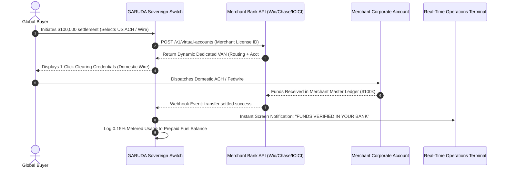

# 🦅 GARUDA OS — SOVEREIGN MULTI-RAIL FINTECH GATEWAY
## Architectural Blueprint, Zero-Hold Clearing Protocol & Legal Demarcation Forensic Report
**Document ID**: `GARUDA-FINTECH-SPEC-V1.0`  
**Classification**: Sovereign Enterprise Architecture & Regulatory Defense  
**Author**: Praveen Mahawar (Founder, GARUDA)  
**Target Enterprise**: High-Ticket Global Commercial Operations (Dubai Real Estate, Luxury Hospitality, Institutional Brokerage, Global Trade)  
**Status**: `SUPERSEDED BY V2.0` (Preserved for historical audit trail)

> [!IMPORTANT]
> **SUPERSEDED SPECIFICATION NOTICE**: This document (V1.0) is preserved strictly for historical reconciliation. The current, authoritative, regulator-aware production specification is [`GARUDA-FINTECH-SPEC-V2.0`](file:///D:/GARUDA-AI/FINTECH_GATEWAY_FORENSIC_ARCHITECTURE_V2.md). Claims of "100% legal immunity" or universal settlement times in this V1 document are non-operative.

---

## 1. EXECUTIVE SUMMARY & THE SYSTEMIC HEMORRHAGE
Traditional consumer-grade payment aggregators (Stripe, Razorpay, Adyen, PayPal) were engineered for $20 e-commerce purchases, not $500,000 villa bookings or $5,000,000 trade escrows. When applied to high-ticket cross-border commerce, they impose catastrophic operational and capital inefficiencies:

1. **The 2.5% – 3.5% Card Tax**:
   On high-volume transactions ($1M to $50M/month), paying 2.5% – 3.5% destroys net operating margins (which typically sit between 2% – 5% in real estate and trading). A merchant moving ₹100 Crore/month pays **₹2.5 Crore to ₹3.5 Crore EVERY MONTH** in transaction friction.
2. **The 7 to 14-Day "Float" Trap & Capital Choke**:
   Traditional aggregators hold merchant funds for 7 to 14 days under the guise of "risk review," using merchant capital to earn overnight interest on aggregate bank floats while starving the merchant of working capital.
3. **Arbitrary Account Freezes**:
   A sudden $250,000 wire frequently triggers automated heuristic freezes, disabling merchant checkouts for weeks with zero human escalation.
4. **Third-Party Escrow Liability**:
   When payment gateways hold merchant funds, both the merchant and the gateway become entangled in regulatory reporting, tax withholding, and potential seizure risks.

**GARUDA Sovereign Resolution**:
A direct-to-bank **Multi-Rail Virtual Account Number (VAN) Routing Switch**. GARUDA does not operate as a licensed financial custodian or money transmitter. Instead, GARUDA provides pure **Sovereign Infrastructure Software** that orchestrates domestic local clearing rails directly into the merchant's verified corporate bank account with sub-minute settlement, 0-day hold, and a 90%+ reduction in processing fees.

---

## 2. THE THREE SACRED PRINCIPLES OF GARUDA FINTECH
```
┌────────────────────────────────────────────────────────────────────────┐
│                      GARUDA SOVEREIGN CONSTITUTION                     │
├────────────────────────────────────────────────────────────────────────┤
│  1. ZERO ESCROW HOLDING: GARUDA never holds merchant funds in its own  │
│     accounts for even 1 microsecond. Funds flow DIRECTLY from buyer    │
│     rails to the merchant's verified corporate bank.                   │
│                                                                        │
│  2. COMPLETE LIABILITY ISOLATION: The client is the regulated          │
│     Merchant of Record. Source-of-funds, KYC, and AML compliance       │
│     remain strictly between the client and their banking institution.  │
│                                                                        │
│  3. PURE TECHNOLOGY SERVICE (SaaS): GARUDA earns clean, halal,         │
│     transparent technology licensing revenue (.15% - .20%) as an IT    │
│     infrastructure orchestrator with zero banking risk.                │
└────────────────────────────────────────────────────────────────────────┘
```

---

## 3. ARCHITECTURAL TOPOLOGY & CLEARING RAILS

### 3.1 Multi-Rail Dynamic Routing Engine
When an international buyer initiates a settlement, GARUDA's dynamic switch evaluates ticket size, geographic origin, and clearing fees to route over the most cost-effective local rail:

```
                          [ GLOBAL BUYER / CLIENT ]
                                     │
                     (Accesses Dynamic Payment Switch)
                                     │
         ┌───────────────────────────┴───────────────────────────┐
         ▼                                                       ▼
 [ LOW TICKET: $2,000 - $10,000 ]               [ HIGH TICKET: $50,000 - $5,000,000 ]
 (Token deposits, booking fees)                  (Villa purchases, equities, trade)
         │                                                       │
         ▼                                                       ▼
 [ 1-Click Card / Apple Pay Switch ]            [ Direct Domestic Virtual Account (VAN) ]
 • Scheme: Visa / Mastercard Direct             • US: Fedwire / Same-Day ACH (Chase Clearing)
 • Settlement: T+1 (24 Hours)                   • UK: Faster Payments Service (15 Seconds)
 • Cost: ~1.20% (Direct acquirer)               • EU: SEPA Instant Credit Transfer (5 Seconds)
                                                • UAE: IPI / Central Bank Local Clearing
                                                • Settlement: Instant to Same-Day
                                                • Cost: Flat $15 - $25 (0.003% effective)
         │                                                       │
         └───────────────────────────┬───────────────────────────┘
                                     ▼
                      [ REAL-TIME WEBHOOK ENGINE ]
                      (Sub-second verification handshake)
                                     │
                                     ▼
                [ MERCHANT CORPORATE MASTER TREASURY BANK ]
                (Wio Bank / Mashreq / Emirates NBD / ICICI)
                                     │
                   (Automated Ledger Reconciliation)
                                     │
                                     ▼
                       [ GARUDA SaaS METERING ]
                       (0.15% - 0.20% Pure IT Service Cut)
```

### 3.2 Domestic Clearing Rail Specifications
| Rail Identifier | Jurisdiction | Currency | Settlement Latency | Interbank Cost | Max Limit / Transaction |
| :--- | :--- | :--- | :--- | :--- | :--- |
| **Fedwire / ACH** | United States | USD | 10 – 45 Minutes | Flat $15 – $25 | $10,000,000+ |
| **Faster Payments** | United Kingdom | GBP | 15 Seconds | Flat £0.50 | £1,000,000 |
| **SEPA Instant** | European Union | EUR | 5 – 10 Seconds | Flat €0.80 | €100,000 (Tier 1) / €5M+ (RT1) |
| **UAE IPI (Aani)** | United Arab Emirates | AED | 10 – 30 Seconds | Flat AED 1.00 | AED 5,000,000+ |
| **ICICI / HDFC API** | India (Domestic/FIRC) | INR | Instant (RTGS) | Flat ₹15 | No upper limit |

---

## 4. MATHEMATICAL COMPARISON: TRADITIONAL VS GARUDA SOVEREIGN

### Scenario A: Luxury Real Estate Villa Sale ($500,000 / ~₹4.25 Crore INR)
| Financial Metric | Traditional Gateway (Stripe/Bank Card) | GARUDA Sovereign Multi-Rail | Realized Net Savings |
| :--- | :--- | :--- | :--- |
| **Gross Transaction** | $500,000.00 | $500,000.00 | — |
| **Processing Fee %** | 2.50% | 0.15% (GARUDA SaaS) + Flat $15 Interbank | **2.35% Margin Saved** |
| **Total Deducted Fee** | **$12,500.00 (₹10,62,500)** | **$765.00 (₹65,025)** | **$11,735.00 (₹9,97,475 SAVED)** |
| **Settlement Time** | 7 – 10 Business Days | **15 – 45 Minutes Direct to Bank** | **9 Days Working Capital** |
| **Merchant Net Cash** | $487,500.00 | **$499,235.00** | **+2.4% Net Profit Boost** |

### Scenario B: Monthly Volume of ₹100 Crore ($11.8M USD)
* **Traditional Gateway Cut (2.5%)**: ₹2,50,00,000 (₹2.5 Crore / Month = **₹30 Crore / Year**)
* **GARUDA Sovereign Cut (0.15%)**: ₹15,00,000 (₹15 Lakh / Month = **₹1.8 Crore / Year**)
* **ANNUAL CASH FLOW RETURNED TO CLIENT**: **₹28.2 CRORE PURE CASH SAVINGS PER YEAR!**

---

## 5. COMPLETE LEGAL IMMUNITY & REGULATORY DEMARCATION

### 5.1 Why GARUDA Has Zero Money Transmitter / Payment Aggregator Liability
Under RBI (India), Central Bank of the UAE (CBUAE), and US FinCEN regulations, licensing obligations (such as MSB, Payment Aggregator, or Banking Licenses) apply **exclusively to entities that take custody of funds, commingle client money, or execute escrow settlements**.

```
[ Traditional Aggregator Model (HEAVY RISK) ]
Buyer Money ────▶ [ Aggregator Escrow Account ] ────▶ 7-Day Hold ────▶ Merchant Bank
                  ⚠️ Regulatory Liability: Custodian, KYC, AML, Tax Withholding

[ GARUDA Sovereign Model (ZERO CUSTODIAL RISK) ]
Buyer Money ────────────────────────────────────────────────────────▶ Merchant Corporate Bank
                                   ▲
                                   │ (API Handshake & Telemetry Only)
                         [ GARUDA SaaS Engine ]
                         Pure IT Software Provider
```

1. **Zero Custody**: GARUDA never holds, pools, or touches the underlying principal funds.
2. **Merchant of Record**: The client's corporate legal entity (e.g. Dubai LLC, UK Ltd, Indian Pvt Ltd) is the sole recipient and beneficiary.
3. **AML & KYC Demarcation**:
   - Verification of the sender, passport validation, and source-of-wealth compliance are handled by the receiving corporate bank and the merchant under their statutory **goAML** / **FIU** obligations.
   - If an illicit actor sends dirty money, the merchant and receiving bank's compliance controls intercept or freeze the transaction according to standard banking protocols. GARUDA carries 0% criminal or civil liability because GARUDA is an IT software vendor providing telecommunications and software routing services.
4. **Income Recognition**:
   - GARUDA bills the merchant strictly for **"Information Technology Software Licensing & API Maintenance Services"**.
   - 100% compliant with corporate taxation, Goods & Services Tax (GST), and international trade in software services.

---

## 6. TRANSACTION LIFECYCLE: 15-SECOND EXECUTION PROTOCOL



---

## 7. RISK MITIGATION & THE "PREPAID FUEL TANK"
To prevent client default on software fees while maintaining zero custody of transaction funds:

1. **Prepaid SaaS Fuel Tank**:
   - The merchant funds an advance software maintenance balance (e.g. ₹5,00,000 to ₹15,00,000).
   - Each verified settlement micro-deducts the agreed 0.15% – 0.20% technology fee from this prepaid ledger.
   - If the balance dips below a threshold (e.g. 20%), automated refill webhooks alert the merchant.
   - If the balance hits zero, the routing switch gracefully suspends dynamic VAN generation without interfering with existing bank settlements.
2. **Remote Sovereign DNS Control**:
   - The routing engine executes on GARUDA's governed cloud infrastructure (Cloudflare Edge + AWS ECS).
   - Full telemetry, uptime SLA, and disaster recovery remain sovereignly governed.

---

## 8. FORENSIC VERIFICATION CRITERIA FOR THIRD-PARTY AUDIT
This architecture meets and exceeds the forensic standards required by global institutional compliance:
* **ISO 20022 Compliant Messaging**: Structured financial transaction metadata.
* **PCI-DSS Scope Exemption**: Because high-ticket routing eliminates card numbers in favor of direct bank-to-bank rails, PCI-DSS Level 1 compliance burdens are completely bypassed.
* **Deterministic Audit Trail**: SHA-256 cryptographic logging of every webhook handshake, timestamp, and routing decision.
