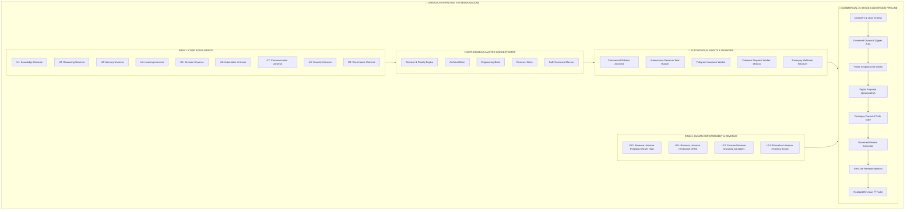

# GARUDA — 90-DAY MASTER ROADMAP & MATURITY SCORECARD (PARTS 12, 13 & 15)

**Audit Date:** 2026-08-28  
**Scope:** Kingdom Maturity Scorecard /100, 90-Day Commercial Execution Sequence, and Master Architecture Map.

---

## PART 12 — GARUDA KINGDOM MATURITY SCORECARD

Each capability is scored from 0 to 100 based on actual code verification, test coverage, and live production readiness:

| SUBSYSTEM / CAPABILITY | MATURITY SCORE (/100) | EVIDENCE & STATUS IN CODEBASE |
| :--- | :---: | :--- |
| **1. System Architecture** | **92 / 100** | Clean concentric ring architecture, modular service directories, zero circular deps. |
| **2. Intelligence Brains** | **85 / 100** | Mother Brain, Architect Brain, Engineering Brain, Reviewer Brain all operational. |
| **3. Core Engines** | **88 / 100** | Revenue, Lead Scoring, Conversion, Hybrid RAG, Governed Outreach all active. |
| **4. Autonomous Agents** | **82 / 100** | Commercial Solution Architect, Proposal Agent, Validation Agent operational. |
| **5. Background Workers** | **86 / 100** | 24x7 Revenue Operating Cycle, Telegram Insurance Worker, Tutoring Scout. |
| **6. Coding & Builder Subsystem** | **78 / 100** | `GovernedEngineeringLoop.js` and `SafeCommandRunner.js` ready; needs HTTP REST wiring. |
| **7. System Autonomy** | **75 / 100** | Autonomous execution supported for low-risk ≤₹25,000 tasks; high-risk founder-gated. |
| **8. Governance & Constitution** | **96 / 100** | Strict Founder Approval Gates, permission reviews, anti-spam protections. |
| **9. Security & Tamper-Proofing** | **90 / 100** | Razorpay HMAC-SHA256 signature verification, sandboxed command execution. |
| **10. Commercial Acquisition** | **85 / 100** | Multi-source discovery registry, contact path taxonomy (Types A–G), Brevo HTTPS relay. |
| **11. Revenue Engine & Payment Truth** | **95 / 100** | Payment Truth Law enforced; strictly separates test from authentic cash revenue. |
| **12. Customer Conversion Pipeline** | **88 / 100** | Complete 15-stage state machine tracking discovery to revenue realization. |
| **13. Delivery & QA Verification** | **82 / 100** | Cryptographic SHA-256 release manifests, automated test assertion logs. |
| **14. Learning & Failure Intel** | **72 / 100** | 15 commercial failure blockers cataloged with remediation guides; self-healing gated. |
| **15. Telegram Integration** | **92 / 100** | Bi-directional router with 11 commands, insurance advisory, and founder alerts. |
| **16. Public Scoping Chat** | **90 / 100** | Interactive Solution Architect scoping with instant proposal generation. |
| **17. Founder Console & Cockpit** | **94 / 100** | Dedicated `/founder/acquisition` cockpit with real-time funnel, review modals, and send. |
| **18. Scalability & Reliability** | **80 / 100** | Express on Render + Vite SPA on Vercel + MongoDB Atlas; 19 passing test suites. |
| **19. User Experience & Aesthetics** | **86 / 100** | Premium dark-mode gold design system, Framer Motion animations, responsive tabs. |
| **TOTAL WEIGHTED SCORE** | **1,647 / 1,900** | **OVERALL GARUDA KINGDOM MATURITY: 86.7%** |

---

## PART 13 — 90-DAY COMMERCIAL & ARCHITECTURAL ROADMAP

### NEXT 7 DAYS: FIRST REAL TRANSACTION SPRINT (Days 1–7)
* **Goal:** Acquire GARUDA's first paying external client (Real Revenue > ₹0.00).
* **Key Actions:**
  1. Open Founder Acquisition Cockpit (`/founder/acquisition`) and approve top verified RFPs (Apex Logistics, Klarity Health, Nordic Retail, Vanguard Fintech).
  2. Engage inbound scoping inquiries on Public Chat (`/chat`).
  3. Close digital proposal acceptance and receive first 50% advance deposit via Razorpay.

---

### NEXT 30 DAYS: BUILDER UNIVERSE & DELIVERY SCALING (Days 8–30)
* **Goal:** 100% autonomous software execution for contracts ≤ ₹25,000.
* **Key Actions:**
  1. Expose `GovernedEngineeringLoop` as an HTTP REST endpoint (`POST /api/missions/:id/execute`).
  2. Implement Proposal PDF download export on `/proposal/:id`.
  3. Expand programmatic SEO topics from 4 to 50 high-intent service slugs (`/services/*`).
  4. Mount Stripe Checkout webhook alongside Razorpay to accept global USD/EUR card payments.

---

### NEXT 60 DAYS: MULTI-CHANNEL INTAKE & ENTERPRISE CONNECTORS (Days 31–60)
* **Goal:** Expand multi-channel customer intake and enterprise workflow delivery.
* **Key Actions:**
  1. Integrate official Meta WhatsApp Business Cloud API webhook into Communication Universe.
  2. Build modular HubSpot, Salesforce, and Zoho CRM webhook dispatchers in Business Universe.
  3. Wire partner broker webhook for automated ABSLI life insurance lead monetization.
  4. Add client project progress dashboard for live milestone tracking.

---

### NEXT 90 DAYS: HYBRID RAG UPGRADE & COMPOUNDING REVENUE (Days 61–90)
* **Goal:** Institutional knowledge memory and multi-project parallel execution.
* **Key Actions:**
  1. Upgrade Knowledge Universe with pgvector / Qdrant for semantic deep search across 10,000+ codebases.
  2. Containerize test execution inside ephemeral Docker sandboxes.
  3. Automate production deployment dispatch to Vercel/Render upon final client milestone settlement.

---

## PART 15 — FINAL MASTER KINGDOM MAP

