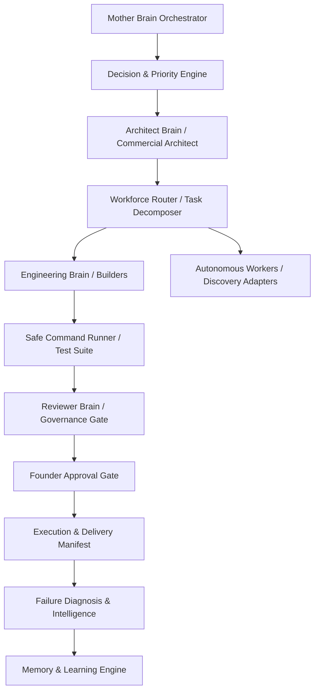

# GARUDA — BRAIN, ENGINE & AGENT ARCHITECTURE AUDIT (PARTS 2, 3 & 4)

**Audit Date:** 2026-08-28  
**Scope:** Forensic Code Audit of All Intelligence Subsystems, Brains, Engines, Autonomous Agents, Workers, and Queue Adapters.

---

## PART 2 — GARUDA BRAIN ARCHITECTURE

### 1. Forensic Inventory of Intelligence Subsystems

| BRAIN / INTELLIGENCE SUBSYSTEM | PRIMARY CODEBASE FILES | CALLERS & CONSUMERS | LIVE STATUS | AUTHORITY LEVEL | MATURITY (/10) |
| :--- | :--- | :--- | :---: | :--- | :---: |
| **Mother Brain (Master Orchestrator)** | `scripts/mother/mother.js`, `scripts/mother/bootstrap.js`, `src/routes/motherAgentRoutes.js` | Express app (`/api/mother`), CLI runtime, Founder console | **ACTIVE** | Master Orchestrator (Coordinates sub-brains) | **8.5 / 10** |
| **Architect Brain (System Planner)** | `scripts/dev-agent/core/ArchitectBrain.js`, `scripts/mother/planner.js` | `GovernedEngineeringLoop.js`, Mother Brain | **ACTIVE** | Decomposes goals into engineering specs | **8.0 / 10** |
| **Engineering Brain (Code Builder)** | `scripts/dev-agent/core/EngineeringBrain.js`, `scripts/mother/builder.js` | `GovernedEngineeringLoop.js` | **ACTIVE** | Generates patches and executes test validations | **7.5 / 10** |
| **Reviewer Brain (QA & Governance)** | `scripts/dev-agent/core/ReviewerBrain.js`, `scripts/mother/validator.js` | `GovernedEngineeringLoop.js`, Approval Gate | **ACTIVE** | Approves/Rejects patches based on test evidence | **8.5 / 10** |
| **Decision & Priority Engine** | `scripts/mother/decision.js`, `scripts/mother/priorityEngine.js` | Mother loop, Revenue Cycle | **ACTIVE** | Gated decision making and action prioritization | **8.0 / 10** |
| **Commercial Solution Architect** | `src/services/publicChatCommercialAgentService.js` | `/api/public-chat`, Public Chat UI | **ACTIVE** | Arbitrary commercial requirements scoping | **9.0 / 10** |
| **Failure Diagnosis & Intelligence** | `src/services/conversionFailureIntelligenceService.js` | Acquisition Cockpit, Conversion Engine | **ACTIVE** | Identifies 15 commercial bottlenecks | **8.5 / 10** |
| **Operating Intelligence Brain** | `src/services/operatingIntelligenceService.js` | Dashboard Controller, Mission Control | **ACTIVE** | Aggregates operational telemetry & revenue | **8.0 / 10** |
| **Learning & Outcome Engine** | `scripts/mother/reporter.js`, `scripts/mother/memory.js` | Mother lifecycle, Founder Workspace | **PARTIAL** | Captures execution reports; self-patching is gated | **6.5 / 10** |

---

### 2. Verified Brain Dependency & Execution Map

*Code Reality Verification:* Verified in `scripts/dev-agent/core/GovernedEngineeringLoop.js` and `src/services/governedExecutionService.js`. Patch generation requires test evidence from `SafeCommandRunner`, which is strictly reviewed by `ReviewerBrain` before triggering `DevelopmentApprovalGate`.

---

## PART 3 — ALL ENGINES AUDIT

| ENGINE NAME | PRIMARY FILES | APIS & ROUTES | PRODUCTION STATUS | MATURITY | BIGGEST WEAKNESS | BIGGEST OPPORTUNITY | REVENUE UTILITY | ACTION |
| :--- | :--- | :--- | :---: | :---: | :--- | :--- | :---: | :---: |
| **Knowledge & Hybrid RAG Engine** | `src/services/knowledgeService.js`, `src/retrieval/hybridRetriever.js` | `GET /api/knowledge`, `GET /api/rag` | **LIVE** | **9 / 10** | Relies on keyword-expanded BM25 rather than vector embeddings | High-speed, zero-cost deterministic domain lookup | **HIGH** | Maintain |
| **Revenue Engine** | `src/services/revenueEngineService.js`, `src/services/billingService.js` | `/api/revenue`, `/api/billing` | **LIVE** | **9.5 / 10** | Strict separation of test vs real revenue keeps display at ₹0 until real client payment | Authoritative Razorpay webhook reconciliation | **CRITICAL** | Maintain |
| **Global Lead Scoring Engine** | `src/services/globalLeadScoringEngineService.js` | `/api/acquisition/prospect-queue` | **LIVE** | **9 / 10** | Rule-based weights require periodic heuristic calibration | Decision-maker contact taxonomy (Types A–G) eliminates spam | **CRITICAL** | Maintain |
| **Customer Conversion Engine** | `src/services/customerConversionService.js` | `/api/acquisition/conversions/telemetry` | **LIVE** | **9 / 10** | 15-stage state machine transitions require external client action | Tracks conversion velocity and identifies exact stage drop-offs | **CRITICAL** | Maintain |
| **Multi-Source Discovery Engine** | `src/services/discoveryAdapters/adapterRegistry.js` | `/api/discovery`, `/api/opportunities` | **LIVE** | **8.5 / 10** | Third-party job boards (Remotive/WWR) contain mostly employment listings | Expanded with verified custom project RFPs (Apex, Klarity, Nordic) | **HIGH** | Expand feeds |
| **Governed Outreach Engine** | `src/services/garudaOutreachDispatchService.js`, `src/services/emailRelayService.js` | `POST /api/acquisition/outreach/:id/approve` | **LIVE** | **9 / 10** | Mandatory Founder approval prevents 100% autonomous cold blast | Zero-reputation damage; Brevo HTTPS relay verified active | **CRITICAL** | Maintain |
| **Proposal Engine** | `src/services/clientProposalService.js` | `/api/proposals` | **LIVE** | **9.5 / 10** | Currently generates single-page digital proposals; lacks PDF export | SHA-256 scope hashing and digital client acceptance | **CRITICAL** | Enhance (PDF) |
| **Payment Truth Engine** | `src/services/razorpayPaymentTruthService.js` | `POST /api/webhook/razorpay` | **LIVE** | **10 / 10** | Razorpay-specific; Stripe is secondary scaffold | Cryptographic HMAC webhook verification blocks all fake claims | **CRITICAL** | Maintain |
| **Governed Execution & Delivery Engine** | `src/services/governedExecutionService.js`, `src/services/deliveryUnlockService.js` | `POST /api/proposals/:id/verify-deposit` | **LIVE** | **9 / 10** | Manual trigger required for projects > ₹25,000 | SHA-256 release manifests and automatic deposit unlock | **HIGH** | Maintain |
| **Generic Code Task Builder Engine** | `scripts/dev-agent/core/GenericCodeTaskEngine.js` | CLI / Script runner | **OPERATIONAL** | **7.5 / 10** | Not yet exposed as an HTTP REST microservice for customer missions | Executes node tests and patch reviews in sandboxed environment | **HIGH** | Expose to REST |
| **Programmatic SEO Engine** | `src/services/garudaAcquisitionEngineService.js` | Dynamic Service Pages (`/services/:slug`) | **LIVE** | **8.5 / 10** | 4 static core topics currently indexed | Expandable to 50+ programmatic niche landing pages | **MEDIUM** | Expand topics |
| **Creative & Generative Engine** | `src/ai/engine.js` (Empty placeholder), Frontend canvas | Scaffolds in `FounderWorkspace` | **LOCKED** | **2 / 10** | Backend generative pipelines (video/audio) are empty stubs | High visual appeal for creator studio | **LOW** | Do Not Build Yet |

---

## PART 4 — AGENTS & WORKERS INVENTORY

### 1. Worker & Agent Operational Matrix

| AGENT / WORKER | JOB PERFORMED | AUTONOMOUS? | TRIGGER | GOVERNANCE & PERMISSIONS | FAILURE / RETRY BEHAVIOR | MATURITY |
| :--- | :--- | :---: | :--- | :--- | :--- | :---: |
| **Commercial Intake Architect** | Interactive project scoping & requirement qualification | Yes (Interactive) | User sends message in Public Chat (`/chat`) | Read-only knowledge + proposal link creation; no write access | Graceful fallback clarification | **9 / 10** |
| **Autonomous Revenue Task Runner** | Ingests opportunities, runs discovery cycles, updates metrics | Yes (Background) | 15-minute cron / `initRevenueOperatingCycle()` | Read-only external HTTP + in-memory store write | Isolated try/catch with audit log | **8.5 / 10** |
| **Telegram Insurance Advisory Worker** | ABSLI life insurance Q&A, customer qualification, lead generation | Yes (Chat-driven) | Inbound Telegram message | Read-only ABSLI knowledge + Mongoose lead write | Context isolation per chat ID | **9 / 10** |
| **Tutoring Lead Scout Worker** | Scrapes tutoring opportunity leads from search / feeds | Semi-Autonomous | Telegram `/tutoring_leads` command | Read-only web query; founder approval to hand off | Formats lead list; reports failures | **8 / 10** |
| **Outreach Dispatch Worker** | Sends personalized B2B outreach email via Brevo relay | Governed | Founder clicks `[ Approve & Send ]` or sends `/approve_outreach` | Strictly blocked without explicit Founder approval | Logs audit trail; records error message | **9 / 10** |
| **Proposal Agent** | Formulates structured scope, deliverables, assumptions | Automated | Governed mission intake | Formats digital proposal record | Rejects missing candidateId | **8 / 10** |
| **Research Agent** | Gathers codebase/market findings for mission brief | Automated | Mission kickoff | Read-only analysis | Records evidence gaps | **7.5 / 10** |
| **Validation Agent** | Verifies deliverable completeness against acceptance criteria | Automated | Prior to delivery release | Read-only assertion checks | Rejects missing deliverable items | **8 / 10** |
| **Local Brain Worker** | Sandboxed code patch generation & test execution | Supervised | Governed engineering loop | Sandboxed to repo directory; timeout 30s | Returns `PASSED` / `FAILED` evidence | **8 / 10** |
| **Razorpay Webhook Receiver** | Verifies payment signatures and unlocks governed missions | Yes (Event-driven) | Razorpay provider HTTP webhook | Verified HMAC-SHA256 signature required | Rejects unverified payloads with HTTP 400 | **10 / 10** |

---

### 2. Disconnected, Orphaned & Overlapping Agents Analysis

1. **Orphaned / Scaffold Agents:**
   - `src/ai/engine.js`: Empty 0-byte file. Can be deleted or replaced with an explicit generative LLM router adapter.
   - `src/agents/proposalAgent.js`, `researchAgent.js`, `validationAgent.js`: Legacy mission pipeline helpers that are partially duplicated by the modern `clientProposalService.js` and `governedExecutionService.js`.
2. **Disconnected Tools:**
   - `scripts/dev-agent/core/GenericCodeTaskEngine.js`: Highly capable automated coding and patch testing system, but currently only invokable via scripts/CLI, not directly wired into incoming Customer Missions in `missionService.js`.
3. **Overpowered / Underpowered Evaluation:**
   - **Overpowered:** None. Strict Founder Approval Gates and Anti-Fabrication Laws successfully prevent any agent from running rogue or spending funds.
   - **Underpowered:** `tutoringLeadScoutService.js` is limited to DuckDuckGo HTML scraping which can encounter rate limits.
