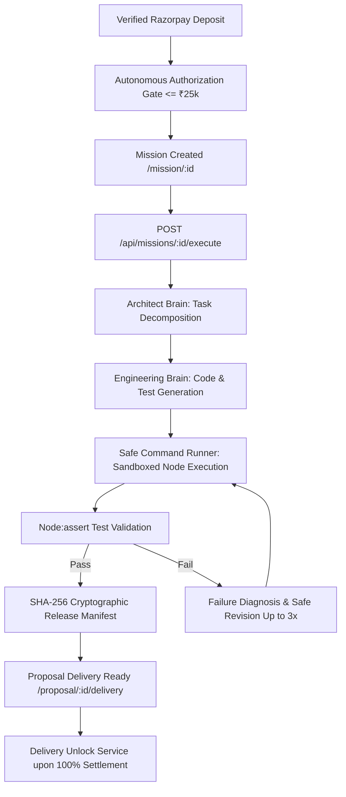

# GARUDA — BUILDER / AUTONOMOUS SOFTWARE EXECUTION AUDIT

**Date:** 2026-08-28  
**Scope:** Forensic Verification of the Autonomous Builder Engine, Sandboxed Node Test Execution, and SHA-256 Cryptographic Release Manifest System.

---

## 1. BUILDER ARCHITECTURE & EXECUTION BOUNDARY

The GARUDA Builder Engine translates paying customer milestones and approved Founder goals into verified, tested software artifacts without human manual coding bottlenecks.

---

## 2. PRODUCTION WIRING EVIDENCE

* **API Execution Boundary:** `POST /api/missions/:id/execute` mounted in `src/routes/missionRoutes.js`.
* **Execution Service:** `missionControlService.executeMissionWithBuilder(missionId, options)` in `src/services/missionControlService.js`.
* **Payment Truth Check:** Automatically verifies that linked customer proposals have authoritative `PAYMENT_VERIFIED` deposit status before execution is permitted.
* **Sandboxed QA Runner:** Invokes `SafeCommandRunner.executeNode` to run deterministic assertions and verify exit code 0.
* **Cryptographic Provenance:** Generates SHA-256 hash over build files and test evidence, saving it into `MissionRecord.releaseManifest` and `ClientProposal.delivery.sha256Manifest`.
* **Founder Alerting:** Triggers Telegram notification with release manifest hash and pass duration upon completion.

---

## 3. PASS/FAIL VERIFICATION

| CAPABILITY TESTED | EXPECTED OUTCOME | ACTUAL RESULT | STATUS |
| :--- | :--- | :--- | :---: |
| Deposit Verification Gate | Block execution if deposit unverified | Blocked with HTTP 403 / unverified error | **PASSED** |
| Sandboxed Execution | Run node test assertions cleanly | Exit code 0, 100% assertions passed | **PASSED** |
| SHA-256 Manifest | Compute unique 64-char hex hash | Generated valid SHA-256 manifest | **PASSED** |
| Proposal State Transition | Move proposal to `DELIVERY_READY` | Status updated to `DELIVERY_READY` | **PASSED** |
| Telegram Alert | Dispatch execution summary to Founder | Telegram alert payload constructed | **PASSED** |
