# GARUDA — MASTER INTEGRATED KINGDOM EXECUTION ROADMAP

**Document Version:** 1.0 (Master Unified Architecture)  
**Date:** 2026-08-28  
**Status:** **ACTIVE PRODUCTION BLUEPRINT**

---

## A. CURRENT ARCHITECTURE & KINGDOM OVERVIEW

GARUDA AI is an autonomous, self-marketing, self-executing AI Operating System designed to understand business requirements, formulate architectural solutions, generate digital proposals, accept authoritative Razorpay payments, execute software deliverables via governed coding loops, verify quality with automated test suites, and settle revenue under strict Payment Truth laws.

```mermaid
graph TD
    subgraph KINGDOM["👑 GARUDA AI OPERATING SYSTEM"]
        subgraph R1["RING 1: CORE INTELLIGENCE"]
            U1["Knowledge Universe (Hybrid RAG)"]
            U2["Reasoning Universe (ArchitectBrain)"]
            U3["Memory Universe (Thread & Context Memory)"]
            U4["Learning Universe (Failure Intelligence)"]
            U5["Decision Universe (Priority & Risk Gates)"]
            U6["Automation Universe (24x7 Revenue Cycles)"]
            U7["Communication Universe (Telegram, Brevo, Chat)"]
            U8["Security Universe (HMAC Truth, Sandboxes)"]
            U9["Governance Universe (Founder Approval Gates)"]
        end

        subgraph MB["🧠 MOTHER BRAIN ORCHESTRATION"]
            MB_CORE["Mother Brain Master Runtime"]
            PLAN["Multi-Brain Planner"]
            ENG["Engineering Brain"]
            REV["Reviewer Brain"]
            SAFE["Safe Command Runner"]
        end

        subgraph R2["RING 2: REVENUE & HUMAN EMPOWERMENT"]
            U10["Revenue Universe (Primary Commercial Hub)"]
            U11["Business Universe (Enterprise CRM & RFPs)"]
            U12["Finance Universe (Invoicing & Reconciliation)"]
            U14["Education Universe (Tutoring Scout)"]
        end

        subgraph BUILDER["🔨 BUILDER / AUTONOMOUS SOFTWARE EXECUTION"]
            GEL["Governed Engineering Loop"]
            GCTE["Generic Code Task Engine"]
            SBOX["Sandboxed Node Test Runner"]
            MANIF["SHA-256 Cryptographic Manifest Engine"]
        end

        subgraph SURFACES["🖥️ OPERATIONAL & CLIENT SURFACES"]
            CHAT["Public Scoping Chat (/chat)"]
            PORTAL["Proposal Portal (/proposal/:id)"]
            COCKPIT["Founder Sales Cockpit (/founder/acquisition)"]
            TG["Telegram Bot Operational Control"]
        end
    end

    R1 --> MB
    MB --> BUILDER
    R2 --> SURFACES
    SURFACES --> BUILDER
```

---

## B. 27 UNIVERSE INVENTORY & MATURITY STATUS

| UNIVERSE | RING | MATURITY | STATUS CODE | REALITY & IMPLEMENTATION STATE |
| :--- | :---: | :---: | :---: | :--- |
| **U1: Knowledge Universe** | Ring 1 | 9.0 / 10 | **A — Operational** | Live hybrid RAG retriever, document indexing, ABSLI insurance knowledge base. |
| **U2: Reasoning Universe** | Ring 1 | 7.5 / 10 | **B — Incomplete** | `ArchitectBrain.js` logical decomposition, requirement analysis in `/chat`. |
| **U3: Memory Universe** | Ring 1 | 8.5 / 10 | **A — Operational** | Multi-turn conversation memory, thread persistence, founder memory. |
| **U4: Learning Universe** | Ring 1 | 7.0 / 10 | **B — Incomplete** | 15 commercial failure blockers cataloged; continuous metrics. |
| **U5: Decision Universe** | Ring 1 | 8.0 / 10 | **B — Incomplete** | Priority engine, risk scoring, ≤₹25k low-risk autonomous execution gate. |
| **U6: Automation Universe** | Ring 1 | 8.5 / 10 | **A — Operational** | 24x7 background revenue cycles, task queues, webhook automation. |
| **U7: Communication Universe** | Ring 1 | 9.0 / 10 | **A — Operational** | Public Chat, Telegram Bot router, Brevo HTTPS email relay. |
| **U8: Security Universe** | Ring 1 | 8.5 / 10 | **B — Incomplete** | Razorpay HMAC-SHA256 truth verification, sandboxed process runner. |
| **U9: Governance Universe** | Ring 1 | 9.5 / 10 | **A — Operational** | Mandatory Founder approval gates, Anti-Fabrication Law enforcement. |
| **U10: Revenue Universe** | Ring 2 | 9.5 / 10 | **A — Operational** | 15-stage conversion state machine, proposals, billing, payment truth. |
| **U11: Business Universe** | Ring 2 | 4.5 / 10 | **C — Partial** | RFP ingestion (Apex, Klarity, Nordic), business workflow automation. |
| **U12: Finance Universe** | Ring 2 | 5.0 / 10 | **C — Partial** | Multi-currency parsing (USD, AED, INR), income goals, ledger. |
| **U13: Career Universe** | Ring 2 | 1.0 / 10 | **D — UI Only** | Frontend card only; zero backend logic. |
| **U14: Education Universe** | Ring 2 | 5.5 / 10 | **C — Partial** | Tutoring lead scout service with search scraping. |
| **U15–U18: Health, Relations, Travel, Lifestyle** | Ring 2 | 0.5 / 10 | **D — UI Only** | Frontend marketing cards only; zero backend code. |
| **U19: Creative Universe** | Ring 3 | 2.0 / 10 | **E — Locked** | Creator Studio canvas scaffolds; generative video/audio pipelines locked. |
| **U20–U23: Content, Brand, Presence, Entertainment** | Ring 3 | 2.5 / 10 | **D — UI Only** | Programmatic SEO landing pages active; social/media generators UI only. |
| **U24: Wealth Universe** | Ring 4 | 0.5 / 10 | **E — Locked** | Architecturally locked vision concept. |
| **U25–U27: Innovation, Collective, Consciousness** | Ring 4 | 1.0 / 10 | **D — UI Only** | Philosophical/R&D concepts; zero monetization code. |

---

## C. EXISTING PRODUCTION CAPABILITIES

1. **Lead Discovery & Scoring:** Ingests 51+ opportunities, classifies contact paths into Types A–G, and strictly blocks Type F job-board applications.
2. **Founder Sales Cockpit:** Dark/gold UI at `/founder/acquisition` rendering 14 metrics, green/red safety filters, and one-click Brevo approval.
3. **Public Commercial Scoping Agent:** Natural language solution architecture in `/chat` with instant digital proposal link generation.
4. **Digital Proposal Portal:** Accessible at `/proposal/:id` with multi-currency milestone quotes and digital client acceptance.
5. **Razorpay Payment Truth Gate:** Cryptographic webhook verification transitions payments to `PAYMENT_VERIFIED` and triggers governed mission creation.
6. **Governed Builder Core:** `GovernedEngineeringLoop.js` and `SafeCommandRunner.js` compile Node code patches, execute test suites, and generate SHA-256 release manifests.
7. **Telegram Bot Control:** Bi-directional router with 11 commands, ABSLI insurance Q&A, and real-time Founder alerts.

---

## D. MISSING WIRING & DISCONNECTED POINTS

1. **Builder Execution HTTP Endpoint:** `POST /api/missions/:id/execute` missing in `src/routes/missionRoutes.js` to trigger the Governed Engineering Loop directly from customer missions.
2. **Telegram `/approve_outreach` Command:** Alert messages suggested `/approve_outreach <id>` but `garudaCommandRouter.js` lacked the routing handler.
3. **Proposal to Builder Automated Handoff:** Inbound deposit verification created missions in `MissionRecord` but did not execute code generation end-to-end.
4. **Landing Page CTA Deep Linking:** Dynamic CTAs on `/services/*` did not pass the service slug reference into `/chat?ref=...`.

---

## E. EXECUTION PRIORITIES (RANKED)

* **PRIORITY 1 (P0): GARUDA Builder / Autonomous Software Execution Universe** — Connect `GovernedEngineeringLoop` and `SafeCommandRunner` to `POST /api/missions/:id/execute`.
* **PRIORITY 2 (P0): Revenue + Acquisition Closed-Loop Completion** — Ensure deposit verification immediately launches the builder and produces SHA-256 release manifests.
* **PRIORITY 3 (P0): Telegram Command Router Reliability** — Add `/approve_outreach` and `/reject_outreach` handlers with strict error boundaries.
* **PRIORITY 4 (P1): Public Chat & Landing Page Deep Linking** — Connect all service landing pages to `/chat?ref=service_slug`.
* **PRIORITY 5 (P1): Mother Brain Multi-Brain Orchestration** — Unify goal decomposition, planning, execution, and reporting.
* **PRIORITY 6 (P2): Programmatic SEO Expansion** — Scale from 4 to 50 high-intent technology service topics.
* **PRIORITY 7 (P2): Enterprise CRM & ERP Connectors** — Modular HubSpot, Salesforce, and Zoho CRM webhook dispatchers.

---

## F. 30 / 60 / 90 DAY ROADMAP

* **Days 1–7:** First Real External Transaction (Outreach approval, proposal acceptance, deposit payment, automated builder execution).
* **Days 8–30:** Builder scaling, PDF proposal export, Stripe USD checkout integration, 50 programmatic SEO landing pages.
* **Days 31–60:** Official Meta WhatsApp Cloud API connector, enterprise CRM webhooks, partner insurance broker monetization.
* **Days 61–90:** Hybrid RAG vector upgrade (pgvector/Qdrant), Dockerized execution sandboxes, automated Vercel/Render production deploys.
