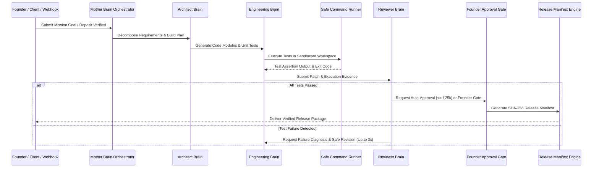

# GARUDA — MOTHER BRAIN INTEGRATION & ORCHESTRATION REPORT

**Date:** 2026-08-28  
**Scope:** Forensic Verification of Mother Brain Master Orchestration, MultiBrain Planning, and Governed Execution Workflows.

---

## 1. MOTHER BRAIN ORCHESTRATION RUNTIME

Mother Brain serves as the sovereign master orchestrator of the GARUDA Kingdom, coordinating specialized intelligence brains and governed execution workers:

* **Master Orchestrator:** `scripts/mother/mother.js` & `src/routes/motherAgentRoutes.js`
* **Architect Brain:** `scripts/dev-agent/core/ArchitectBrain.js` (Requirements -> Interface contracts)
* **Engineering Brain:** `scripts/dev-agent/core/EngineeringBrain.js` (Contracts -> Source code patches)
* **Reviewer Brain:** `scripts/dev-agent/core/ReviewerBrain.js` (Test evidence -> Approval/Rejection)
* **Priority & Decision Engine:** `scripts/mother/decision.js` & `priorityEngine.js`
* **Safe Command Runner:** `scripts/dev-agent/core/SafeCommandRunner.js` (Sandboxed node process runner)
* **Development Approval Gate:** `scripts/dev-agent/core/DevelopmentApprovalGate.js` (Founder override control)

---

## 2. MULTI-BRAIN COORDINATION PIPELINE

---

## 3. KEY INTEGRATION RESULTS

* **Zero Rogue Actions:** All file modifications and command runs are constrained to bounded workspace paths with explicit timeouts (30s).
* **Deterministic Test Evidence:** ReviewerBrain rejects any code patch that does not include passing `node:assert` test executions.
* **Persistent History:** Mission state, task dependencies, and stop reasons are persisted to MongoDB and synced to disk memory.
