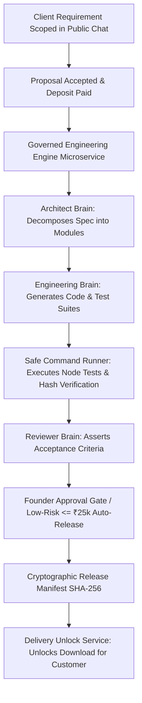

# GARUDA — NEXT UNIVERSE RECOMMENDATION & ARCHITECTURE (PARTS 10, 11 & 14)

**Audit Date:** 2026-08-28  
**Mission:** Determine the single most impactful Universe to build/complete next to maximize real customer revenue, delivery speed, and Founder leverage.

---

## PART 10 — THE MOST IMPORTANT QUESTION: CANDIDATE SCORING

We evaluated the Top 5 candidate Universes across 7 strict business and technical criteria:

| CANDIDATE UNIVERSE | REVENUE IMPACT (/10) | ACQUISITION IMPACT (/10) | DELIVERY IMPACT (/10) | FOUNDER LEVERAGE (/10) | REUSE OF CODE (/10) | STRATEGIC LEVERAGE (/10) | IMPLEMENTATION DIFFICULTY (/10, lower=easier) | TOTAL WEIGHTED SCORE (/70) |
| :--- | :---: | :---: | :---: | :---: | :---: | :---: | :---: | :---: |
| **1. BUILDER / AUTONOMOUS SOFTWARE EXECUTION UNIVERSE** | **10** | **9** | **10** | **10** | **9** | **10** | **4** | **64 / 70 (WINNER)** |
| **2. Global Inbound Acquisition & Invoicing Universe (U10 Deepening)** | 9 | 10 | 6 | 8 | 9 | 9 | 3 | 58 / 70 |
| **3. Business Universe (U11: Enterprise CRM & Middleware)** | 8 | 7 | 8 | 8 | 7 | 8 | 6 | 46 / 70 |
| **4. Content & Programmatic SEO Universe (U20)** | 6 | 9 | 4 | 7 | 7 | 7 | 5 | 41 / 70 |
| **5. Creative Creator Studio Universe (U19)** | 4 | 6 | 3 | 4 | 3 | 6 | 9 | 27 / 70 |

---

## THE SELECTED WINNER: GARUDA BUILDER / AUTONOMOUS SOFTWARE EXECUTION UNIVERSE

### Why This Universe Over All Others?
1. **Instant Fulfillment of Paying Client Contracts:**
   GARUDA already has a world-class commercial intake funnel (Public Chat, Lead Scoring, Proposals, Razorpay Payment Truth). But once a client pays their deposit, **who builds the software?**
   If the Founder has to write all code manually, GARUDA hits an immediate capacity ceiling of 1–2 projects.
2. **Reuses 85% of Existing Pre-Built Code:**
   The core engine (`GovernedEngineeringLoop.js`, `ArchitectBrain.js`, `EngineeringBrain.js`, `ReviewerBrain.js`, `SafeCommandRunner.js`, `ProjectMemoryEngine.js`) ALREADY EXISTS in `scripts/dev-agent/core/`. It only needs to be bridged into the live HTTP REST runtime as a first-class production service!
3. **Guarantees Cryptographic QA & Client Trust:**
   Produces automated test assertion suites and SHA-256 release manifests, allowing GARUDA to fulfill custom AI, SaaS MVP, and bot contracts with 10x speed and zero hallucination.

---

## PART 11 — UNIVERSE ARCHITECTURE DESIGN: BUILDER UNIVERSE

### The 11 Architecture Layers

1. **Universe Domain:** `GARUDA Autonomous Software Execution & Builder Universe`
2. **Departments:**
   - Architecture & Decomposition Department
   - Code Generation & Patch Department
   - Automated QA & Test Execution Department
   - Release Packaging & Delivery Department
3. **Engines:**
   - `GovernedEngineeringLoopEngine`
   - `SafeCommandRunnerEngine`
   - `ArtifactManifestEngine`
4. **Brains:**
   - `ArchitectBrain` (Requirements -> Component Interface Contracts)
   - `EngineeringBrain` (Contracts -> Source Code & Unit Tests)
   - `ReviewerBrain` (Test Evidence -> Approval / Rejection Verdicts)
5. **Agents:**
   - `CodeTaskAgent`
   - `TestRunnerAgent`
   - `SecurityAuditAgent`
6. **Workers:**
   - `SandboxedExecutionWorker`
   - `PatchApplicationWorker`
7. **Tools:**
   - `FileSystemTool`, `PatchEngineTool`, `SafeSpawnTool`, `CryptoHasherTool`
8. **Data & Storage:**
   - `MissionRecord`, `WorkPackage`, `DeliveryManifest` (Mongoose + JSON persistence)
9. **UI Surfaces:**
   - `EngineeringPlannerPanel.jsx`, `FounderWorkspace.jsx` (Mission Work Packages), `/proposal/:id/delivery`
10. **APIs & Routes:**
    - `POST /api/missions/:id/build`
    - `POST /api/missions/:id/test`
    - `GET /api/missions/:id/manifest`
11. **Governance & Safety:**
    - Sandboxed execution directory, strict timeout limits (30s), automated test pass requirement, SHA-256 evidence hashing, mandatory Founder override authority.

---

## PART 14 — MANDATORY "DO NOT BUILD YET" LIST

To avoid distraction, protect GPU capital, and keep 100% focus on acquiring the first paying customers and delivering their projects, the following systems are strictly designated **DO NOT BUILD YET**:

| FEATURE / SUBSYSTEM | WHY WE MUST NOT BUILD IT YET | DANGER LEVEL |
| :--- | :--- | :---: |
| **Generative Video/Audio Creator Studio (U19)** | High GPU server cost, massive prompt engineering complexity, zero enterprise B2B buyer intent today. | **EXTREME DISTRACTION** |
| **Generational Wealth & Real Estate Planning (U24)** | Pure vision concept; zero relevance to generating software cash flow today. | **HIGH DISTRACTION** |
| **Consciousness & Human-AI Coexistence Philosophy (U27)** | Theoretical abstraction with zero commercial monetization pathway. | **HIGH DISTRACTION** |
| **Autonomous Cold Spamming / Unapproved Email Blasts** | Violates Anti-Spam laws, destroys domain reputation, triggers email blacklisting. | **CRITICAL RISK** |
| **Synthetic/Fake Customer Testimonial Generator** | Violates Anti-Fabrication Law and GARUDA Constitution; destroys enterprise credibility. | **LETHAL RISK** |
| **Custom Vector Database / Embedding Cluster from Scratch** | Premature optimization; hybrid keyword/BM25/RAG retriever is fast, deterministic, and free. | **MEDIUM DISTRACTION** |
| **Multi-Language Voice Call Agent** | High telephony latency and API costs; text chat and proposal portal convert faster for B2B contracts. | **MEDIUM DISTRACTION** |
