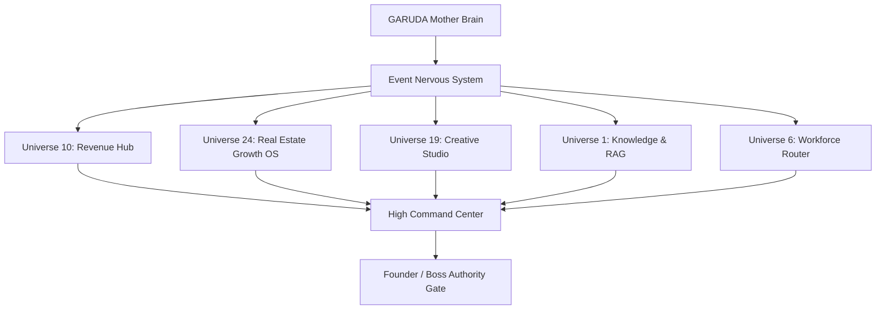

# 🦅 GARUDA KINGDOM — CANONICAL UNIVERSE ACTIVATION & INTEGRATION MAP

> **Classification Standard:**
> - `EXISTS_AND_WORKING`: Fully implemented, operational, verified with automated tests.
> - `EXISTS_PARTIAL`: Core files and logic exist; requires unified cross-universe integration or adapter layer.
> - `ARCHITECTURE_ONLY`: Formally designed and architecturally locked; foundational interfaces ready for progressive activation.
> - `MISSING_BUT_REQUIRED`: Essential for active business direction (e.g. Real Estate Growth OS, Creative Studio Orchestration).
> - `NOT_REQUIRED_YET`: Reserved for far-future civilization milestones; documented without active execution overhead.
>
> **Core Doctrine**: FREE FIRST → REVENUE FIRST → SOVEREIGN ALWAYS.
> **Truth Law**: UNAVAILABLE ≠ ZERO. PLANNED ≠ IMPLEMENTED. CODE_EXISTS ≠ OPERATIONAL.

---

## 1. Executive Summary & Ring Overview

GARUDA's 27 canonical universes are organized into four concentric governance rings:

| Ring | Focus | Universe Count | Active / Primary / Locked | Status |
| :--- | :--- | :---: | :---: | :--- |
| **Ring 1: Core Intelligence** | Mind, Reasoning, Memory, Execution, Governance | 9 | Knowledge (1), Reasoning (2), Memory (3), Automation (6), Communication (7), Governance (9) | **OPERATIONAL** |
| **Ring 2: Human Empowerment** | Business, Revenue, Growth, Real-World Execution | 9 | Revenue Universe (10 - Hub) | **PRIMARY OPERATIONAL** |
| **Ring 3: Creative & Digital** | Media, Studios, Brand, Digital Identity | 5 | Creative Universe (19), Brand (21), Digital Presence (22) | **ACTIVATING FOUNDATION** |
| **Ring 4: Civilization & Future** | Wealth, Real Estate, Swarms, Long-term Vision | 4 | Wealth / Real Estate (24) | **ACTIVATING FOUNDATION** |

---

## 2. Complete 27-Universe Canonical Inventory & Status Matrix



### Detailed Universe Classification Table

| # | Universe Name | Ring | Scope | Canonical Status | Implementation Level | Owner Module / Service | Inputs & Triggers | Outputs & Deliverables | Events Produced / Consumed |
|---|---|:---:|:---:|:---:|:---:|---|---|---|---|
| **1** | **Knowledge Universe** | 1 | Founder | `EXISTS_AND_WORKING` | `EXISTING` | `src/services/abslKnowledgeService.js`, `src/services/verticalKnowledgeService.js`, `src/routes/ragRoutes.js` | Text queries, domain documents, project profiles | Context chunks, semantic vectors, grounded facts | `KNOWLEDGE_SOURCE_UPDATED` |
| **2** | **Reasoning Universe** | 1 | Founder | `EXISTS_AND_WORKING` | `EXISTING` | `scripts/mother/thinker.js`, `src/motherCore/agents/plannerAgent.js` | Goal descriptions, constraints, telemetry signals | Structured execution plans, risk assessments | `AGENT_TASK_CREATED`, `EXECUTION_PLANNED` |
| **3** | **Memory Universe** | 1 | Founder | `EXISTS_AND_WORKING` | `EXISTING` | `scripts/mother/memory.js`, `api/customer.js`, `models/ConversationThread.js` | User sessions, thread IDs, execution logs | Chat history, customer memory, project context | `LEAD_CAPTURED`, `PROJECT_ACTIVATED` |
| **4** | **Learning Universe** | 1 | Founder | `EXISTS_PARTIAL` | `RECOVERED` | `src/services/outcomeLearningService.js`, `docs/LEARNING_ENGINE.md` | Verified outcomes (site visits, bookings, revenue) | Action-outcome weights, conversion feedback signals | Consumes `OUTCOME_RECORDED`, Produces `LEARNING_SIGNAL_CAPTURED` |
| **5** | **Decision Universe** | 1 | Founder | `EXISTS_AND_WORKING` | `EXISTING` | `scripts/mother/decision.js`, `scripts/mother/priorityEngine.js` | Task candidates, revenue priorities | Bounded decisions, approval requests | `REVENUE_GOAL_EVALUATED` |
| **6** | **Automation Universe** | 1 | Founder | `EXISTS_AND_WORKING` | `EXISTING` | `src/services/workforceRouterService.js`, `src/services/revenueOperatingCycleInitializer.js` | Schedulers, queue triggers, webhook events | Automated worker executions, outreach sweeps | `AGENT_TASK_STARTED`, `AGENT_TASK_COMPLETED` |
| **7** | **Communication Universe** | 1 | Founder | `EXISTS_AND_WORKING` | `EXISTING` | `api/public-chat.js`, `src/services/telegramBotService.js`, `src/services/emailRelayService.js` | Visitor messages, Telegram webhooks, inbound email | AI chat replies, founder alerts, email dispatches | `LEAD_CAPTURED`, `ALERT_DISPATCHED` |
| **8** | **Security Universe** | 1 | Founder | `EXISTS_AND_WORKING` | `EXISTING` | `api/auth.js`, `src/services/founderCommandService.js` | JWT tokens, HMAC signatures, Founder keys | Authentication envelopes, sanitized error responses | `SECURITY_AUDIT_LOGGED` |
| **9** | **Governance Universe** | 1 | Founder | `EXISTS_AND_WORKING` | `MANDATORY` | `src/motherCore/approval/approvalPolicy.js`, `src/services/earningModeGovernanceService.js` | High-value actions (>₹25k), external dispatches | Autonomous approval / Founder hold state | `PROPOSAL_APPROVED`, `HUMAN_HANDOFF_REQUIRED` |
| **10** | **Revenue Universe (Hub)** | 2 | Founder/Hub | `EXISTS_AND_WORKING` | `PRIMARY` | `src/services/revenueOperatingCycleService.js`, `src/services/clientProposalService.js`, `src/services/persistentProposalService.js` | Discovery candidates, client proposals, Razorpay webhooks | Scopes, milestones, payment orders, verified deposits | `PROPOSAL_CREATED`, `PAYMENT_VERIFIED`, `PROJECT_ACTIVATED` |
| **11** | **Business Universe** | 2 | Public/Grow | `EXISTS_PARTIAL` | `RECOVERED` | `src/services/realEstateGrowthService.js`, `src/services/clientIntelligenceEngineService.js` | Business profiles, CRM leads, client inquiries | Operational metrics, pipeline management | `LEAD_QUALIFIED`, `SALES_HANDOFF_TRIGGERED` |
| **12** | **Finance Universe** | 2 | Public/Grow | `EXISTS_AND_WORKING` | `EXISTING` | `src/services/revenueValueModelService.js`, `src/models/SettlementLedger.js` | Project currencies, milestone fees, payment receipts | Multi-currency conversions, revenue attribution | `PAYMENT_VERIFIED`, `SETTLEMENT_RECORDED` |
| **13** | **Career Universe** | 2 | Public/Grow | `ARCHITECTURE_ONLY` | `PLANNED` | `frontend/src/config/universes.js` | Professional resumes, skill data | Career roadmaps, interview preparation | None |
| **14** | **Education Universe** | 2 | Public/Grow | `EXISTS_PARTIAL` | `EXISTING` | `scripts/garuda-tutoring-scan.js`, `scripts/garuda-tutoring-import.js` | Academic questions, curriculum data | Tutoring explanations, study plans | None |
| **15** | **Health Universe** | 2 | Public/Grow | `EXISTS_PARTIAL` | `EXISTING` | `src/services/insuranceAdvisorService.js` (Health/Life Insurance) | Insurance & health cover queries | Grounded ABSLI advisor responses | None |
| **16** | **Relationship Universe** | 2 | Public/Grow | `ARCHITECTURE_ONLY` | `PLANNED` | `frontend/src/config/universes.js` | Reminders, contact events | Context notes, celebration alerts | None |
| **17** | **Travel Universe** | 2 | Public/Grow | `ARCHITECTURE_ONLY` | `PLANNED` | `frontend/src/config/universes.js` | Destination queries, booking intents | Itineraries, expense breakdowns | None |
| **18** | **Lifestyle Universe** | 2 | Public/Grow | `ARCHITECTURE_ONLY` | `PLANNED` | `frontend/src/config/universes.js` | Routine data, personal systems | Productivity recommendations | None |
| **19** | **Creative Universe** | 3 | Public/Create | `EXISTS_PARTIAL` | `NEWLY_ACTIVATED` | `src/services/creativeStudioService.js`, `docs/CREATIVE_STUDIO.md` | Creative briefs, brand assets, campaign targets | Ad copy, headlines, hooks, storyboards, image/video prompts | `CREATIVE_BRIEF_CREATED`, `CREATIVE_ASSET_GENERATED` |
| **20** | **Content Universe** | 3 | Public/Live | `EXISTS_PARTIAL` | `RECOVERED` | `src/services/creativeStudioService.js` (Multi-channel Content) | Topic themes, platform targets (IG, YT, LinkedIn) | Multi-format content drafts, captions, hashtags | `CONTENT_PIECE_GENERATED` |
| **21** | **Brand Universe** | 3 | Public/Live | `EXISTS_AND_WORKING` | `NEWLY_ACTIVATED` | `src/services/creativeStudioService.js` (IdentityLock™) | Brand guidelines, color hexes, logo references | IdentityLock™ style constraints, consistency checks | `BRAND_IDENTITY_ENFORCED` |
| **22** | **Digital Presence Universe** | 3 | Public/Live | `EXISTS_PARTIAL` | `EXISTING` | `src/services/digitalGrowthEngineService.js`, `src/services/revenueOutreachService.js` | Web visitors, outreach targets, attribution UTMs | Attribution tracking, lead capture, reputation monitoring | `LEAD_CAPTURED`, `ATTRIBUTION_RESOLVED` |
| **23** | **Entertainment Universe** | 3 | Public/Live | `ARCHITECTURE_ONLY` | `PLANNED` | `frontend/src/config/universes.js` | Interactive storylines, character specs | Narrative assets, game logic | None |
| **24** | **Wealth / Real Estate OS** | 4 | Founder | `EXISTS_PARTIAL` | `NEWLY_ACTIVATED` | `src/services/realEstateGrowthService.js`, `src/services/verticalKnowledgeService.js` | Real estate projects, inventory units, buyer leads | Lead deduplication, 0-100 scoring, site visit scheduling, booking tracking | `REAL_ESTATE_PROJECT_CREATED`, `REAL_ESTATE_LEAD_SCORED`, `SITE_VISIT_BOOKED`, `BOOKING_CONFIRMED` |
| **25** | **Innovation Universe** | 4 | Public/Future | `ARCHITECTURE_ONLY` | `PLANNED` | `frontend/src/config/universes.js` | R&D concepts, system prototypes | Experimentation reports | None |
| **26** | **Collective Intelligence** | 4 | Public/Future | `EXISTS_PARTIAL` | `EXISTING` | `scripts/dev-agent/core/MultiBrainPlanner.js`, `src/services/workforceRouterService.js` | Multi-agent task requests | Cross-agent coordination, synthesized reviews | `AGENT_TASK_CREATED`, `AGENT_SWARM_COORDINATED` |
| **27** | **Consciousness & Future** | 4 | Public/Future | `ARCHITECTURE_ONLY` | `PLANNED` | `frontend/src/config/universes.js`, `docs/GARUDA_CONSTITUTION.md` | Core founder principles, ethics | Alignment audits, philosophical boundaries | None |

---

## 3. Cross-Universe Integration Nervous System

```
[ Lead Ingestion ] -> (LEAD_CAPTURED)
        ↓
[ Real Estate OS ] -> (REAL_ESTATE_LEAD_DEDUPLICATED -> REAL_ESTATE_LEAD_SCORED)
        ↓
[ Agent Workforce ] -> (AGENT_TASK_STARTED -> AGENT_TASK_COMPLETED)
        ↓
[ Creative Studio ] -> (CREATIVE_BRIEF_CREATED -> CREATIVE_ASSET_GENERATED)
        ↓
[ Knowledge / RAG ] -> (KNOWLEDGE_SOURCE_UPDATED -> Grounded Context)
        ↓
[ Revenue Engine ] -> (PROPOSAL_CREATED -> PAYMENT_VERIFIED -> PROJECT_ACTIVATED)
        ↓
[ Outcome Learning ] -> (OUTCOME_RECORDED -> LEARNING_SIGNAL_CAPTURED)
        ↓
[ High Command Center ] -> (Authoritative Boss Snapshot & Truthful KPIs)
```

---

## 4. Duplication Prevention Registry

1. **Leads & Inquiries**: Canonical model is `persistentProposalService` & `garudaEventService`. Real Estate leads extend this structure with domain fields (`budget`, `preferredLocation`, `possessionTimeline`, `bhkType`) without creating separate database silos.
2. **Projects & Missions**: Canonical model is `governedProjectDeliveryService` and `persistentProposalService.saveProject`. Real Estate projects register as domain projects with `RealEstateProjectProfile`.
3. **Proposals & Pricing**: Canonical engine is `clientProposalService.js` and `revenueValueModelService.js`.
4. **Events & State**: Canonical engine is `garudaEventService.js` with SHA-256 seals. Zero competing event buses.
5. **Knowledge & RAG**: Canonical engine is `abslKnowledgeService.js` & `verticalKnowledgeService.js`. Domain chunking reuses the verified retrieval pipeline.
6. **Agent Router**: Canonical router is `workforceRouterService.js`. Mother Brain, Dev Agent, and Vertical Agents communicate through unified task envelopes.

---

## 5. Implementation Roadmap & Activation Status

- [x] **Phase 0 & 1**: Forensic Discovery & Canonical Universe Map (`docs/GARUDA_UNIVERSE_ACTIVATION_MAP.md`)
- [x] **Phase 2**: Cross-Universe Event Nervous System (`src/services/garudaEventTypes.js`, `garudaEventService.js`)
- [x] **Phase 3**: Real Estate Growth OS Foundation (`src/services/realEstateGrowthService.js`)
- [x] **Phase 4**: Creative Studio Engine with IdentityLock™ (`src/services/creativeStudioService.js`)
- [x] **Phase 5**: Vertical Knowledge Intelligence Connection (`src/services/verticalKnowledgeService.js`)
- [x] **Phase 6**: Agent Workforce Router (`src/services/workforceRouterService.js`)
- [x] **Phase 7**: Mother Brain Capability Registry Update (`src/services/capabilityRegistryService.js`)
- [x] **Phase 8**: High Command Center Authoritative Snapshot Integration (`src/services/founderCommandService.js`)
- [x] **Phase 9**: Outcome Feedback & Learning Signals (`src/services/outcomeLearningService.js`)
- [x] **Phase 10**: Cross-Universe Integration & Verification Test Suite (`src/services/universeActivationIntegration.test.js`)
