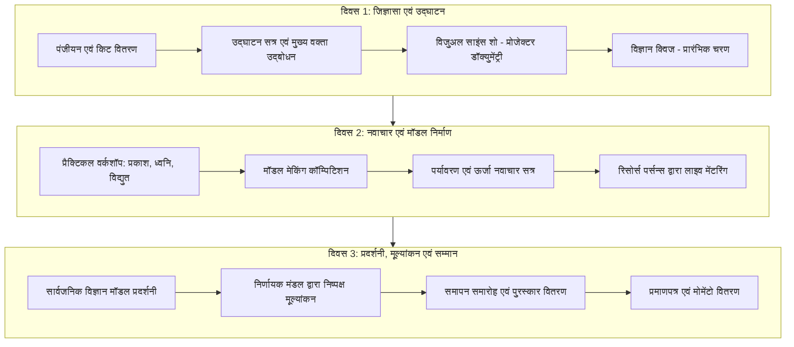

# परियोजना प्रतिवेदन (PROJECT REPORT)
## मध्यप्रदेश विज्ञान एवं प्रौद्योगिकी परिषद (MPCST), भोपाल
### "विज्ञान के प्रचार-प्रसार / विज्ञान लोकव्यापीकरण योजना" के अंतर्गत

---

**परियोजना का नाम**: शाला के विद्यार्थियों की विज्ञान प्रतियोगिता (3-दिवसीय ग्रामीण विज्ञान संवर्धन एवं नवाचार शिविर)  
**प्रायोजक संस्था**: मध्यप्रदेश विज्ञान एवं प्रौद्योगिकी परिषद (MPCST), विज्ञान भवन, नेहरू नगर, भोपाल - 462003  
**स्वीकृत/प्रस्तावित बजट**: ₹ 2,39,100/- (दो लाख उनतालीस हजार एक सौ रुपये मात्र)  
**लक्षित वर्ग**: कक्षा 6वीं से 12वीं तक के शासकीय एवं ग्रामीण शालाओं के विद्यार्थी  
**अवधि**: 3 दिवस  
**माध्यम**: हिन्दी / अंग्रेजी  

---

## 1. प्रस्तावना एवं पृष्ठभूमि (Executive Summary & Background)

मध्य प्रदेश के दूरदराज और ग्रामीण अंचलों में स्कूली विद्यार्थियों के पास प्रतिभा और जिज्ञासा की कोई कमी नहीं है, परंतु संसाधनों, आधुनिक विज्ञान प्रयोगशालाओं (Science Laboratories) और प्रायोगिक उपकरणों के अभाव में उनकी शिक्षा केवल पाठ्यपुस्तकों और सैद्धांतिक रटने तक सीमित रह जाती है। 

इस खाई को पाटने के लिए **मध्यप्रदेश विज्ञान एवं प्रौद्योगिकी परिषद (MPCST)** की 'विज्ञान लोकव्यापीकरण योजना' के तहत यह 3-दिवसीय विज्ञान प्रतियोगिता एवं व्यावहारिक कार्यशाला आयोजित की जा रही है। इसका मूल मंत्र **"करके सीखो" (Learning by Doing)** और **"विज्ञान से समाधान"** है।

---

## 2. स्थानीय आवश्यकता एवं समस्या का विश्लेषण (Local Need & Problem Analysis)

ग्रामीण एवं उपनगरीय क्षेत्रों में निम्नलिखित प्रमुख चुनौतियां पहचानी गई हैं:
1. **प्रायोगिक ज्ञान का अभाव**: विद्यालयों में व्यवस्थित भौतिक, रसायन व जीव विज्ञान लैब न होने से बच्चे केवल किताबी परिभाषाएं याद करते हैं।
2. **डिजिटल व तकनीकी अलगाव**: ग्रामीण विद्यार्थी आधुनिक कंप्यूटर, इंटरनेट, ऑडियो-विजुअल टूल्स और इमर्सिव डिजिटल लर्निंग से वंचित रहते हैं।
3. **स्थानीय समस्याओं के वैज्ञानिक समाधान की समझ की कमी**: जल संरक्षण (Rainwater Harvesting), सौर ऊर्जा (Solar Energy), कचरा प्रबंधन (Waste Management) जैसे आवश्यक विषयों को विज्ञान से जोड़कर देखने के अवसर नहीं मिलते।
4. **मंच और प्रोत्साहन का अभाव**: ग्रामीण बच्चों में छिपे नवाचार (Innovation) को प्रदर्शित करने हेतु कोई बड़ा प्रतिस्पर्धी मंच नहीं मिल पाता।

---

## 3. परियोजना के मुख्य उद्देश्य (Key Objectives)

- **वैज्ञानिक दृष्टिकोण (Scientific Temper) का विकास**: बच्चों में अंधविश्वास और संकोच को दूर कर तार्किक सोच और सवाल पूछने की प्रवृत्ति विकसित करना।
- **व्यावहारिक एवं अनुभवात्मक शिक्षण**: प्रकाश, ध्वनि, विद्युत और पर्यावरण के सिद्धांतों को स्वयं मॉडल बनाकर और हाथों से प्रयोग करके समझना।
- **टीम वर्क एवं नेतृत्व क्षमता**: बच्चों को समूह में काम करने, एक-दूसरे के विचारों का सम्मान करने और आत्मविश्वास के साथ सार्वजनिक प्रस्तुति देने के लिए तैयार करना।
- **डिजिटल साक्षरता की पहली झलक**: लैपटॉप, प्रोजेक्टर और विज्ञान एनिमेशन वीडियो के माध्यम से बच्चों को आधुनिक डिजिटल तकनीक से रूबरू कराना।
- **राज्य के विकास में योगदान**: मध्य प्रदेश के सतत विकास लक्ष्यों (SDGs) के अनुरूप भविष्य के नवाचारियों, वैज्ञानिकों और हुनरमंद नागरिकों की पौध तैयार करना।

---

## 4. लक्षित समूह एवं लाभार्थी प्रोफ़ाइल (Target Beneficiaries)

- **कक्षा**: 6वीं से 12वीं तक के नियमित शाला विद्यार्थी।
- **सामाजिक समावेशिता**: सामान्य (General), अनुसूचित जाति (SC), अनुसूचित जनजाति (ST), अन्य पिछड़ा वर्ग (OBC) तथा विशेष रूप से बालिकाओं (Girls) की 50% से अधिक भागीदारी सुनिश्चित की जाएगी।
- **प्रतिभागियों की अनुमानित संख्या**: 150 से 200 चयनित विद्यार्थी (विभिन्न नजदीकी शासकीय/ग्रामीण विद्यालयों से)।

---

## 5. तीन-दिवसीय विस्तृत कार्ययोजना (3-Day Step-by-Step Schedule)



### दिवस 1: जिज्ञासा और वैज्ञानिक सिद्धांतों का परिचय
- **09:30 AM - 10:30 AM**: छात्र-छात्राओं का पंजीयन, आईडी कार्ड एवं साइंस स्टेशनरी किट वितरण।
- **10:30 AM - 11:30 AM**: उद्घाटन सत्र — दीप प्रज्वलन, अतिथियों एवं रिसोर्स पर्सन्स का स्वागत।
- **11:30 AM - 01:00 PM**: रोचक विज्ञान प्रदर्शन (Fun with Science Live Demo) — प्रोजेक्टर पर वैज्ञानिक खोजों और अंतरिक्ष विज्ञान की डॉक्यूमेंट्री।
- **01:00 PM - 02:00 PM**: दोपहर का भोजन / पौष्टिक अल्पाहार।
- **02:00 PM - 04:00 PM**: "विज्ञान प्रश्नमंच" (Science Quiz Competition) — प्रारंभिक लिखित एवं ओरल बज़र राउंड।
- **04:00 PM - 04:30 PM**: प्रथम दिवस का फीडबैक और अगले दिन के मॉडल विषयों का आवंटन।

### दिवस 2: हाथों से सीखने का दिन (Hands-on Model Making & Innovation)
- **09:30 AM - 10:30 AM**: वैज्ञानिक अवधारणाओं की कार्यशाला (प्रकाश, लेंस, दर्पण, विद्युत परिपथ, ऊर्जा संरक्षण)।
- **10:30 AM - 01:00 PM**: विज्ञान मॉडल मेकिंग प्रतियोगिता (ग्रुप एक्टिविटी):
  - विद्युत एवं चुंबकत्व मॉडल (बल्ब, वायर, स्विच, मोटर)
  - ध्वनि तरंग मॉडल (पेपर कप, स्ट्रिंग रेजोनेंस)
  - पर्यावरण मॉडल (मिट्टी, सौर ऊर्जा, रेन वाटर हार्वेस्टिंग, वेस्ट से वेल्थ)
- **01:00 PM - 02:00 PM**: अल्पाहार / लंच ब्रेक।
- **02:00 PM - 04:00 PM**: मॉडल्स की फिनिशिंग एवं चार्ट प्रेजेंटेशन।
- **04:00 PM - 04:30 PM**: कंप्यूटर व आधुनिक टेक्नोलॉजी अवेयरनेस सेशन (इंटरनेट, एआई, और वैज्ञानिक ऐप्स की जानकारी)।

### दिवस 3: विज्ञान मेला, मूल्यांकन एवं भव्य पुरस्कार वितरण
- **09:30 AM - 12:30 PM**: "भव्य विज्ञान प्रदर्शनी" (Science Exhibition) — स्थानीय समुदाय, शिक्षक, अभिभावक एवं अन्य विद्यार्थियों द्वारा मॉडलों का अवलोकन। विद्यार्थियों द्वारा अपने प्रोजेक्ट्स की मौखिक व्याख्या।
- **12:30 PM - 01:30 PM**: निर्णायक मंडल (तटस्थ विषय विशेषज्ञ व रिसोर्स पर्सन) द्वारा मूल्यांकन।
- **01:30 PM - 02:30 PM**: जलपान एवं लंच ब्रेक।
- **02:30 PM - 04:30 PM**: समापन एवं सम्मान समारोह:
  - मुख्य अतिथि, जिला शिक्षा अधिकारी / गणमान्य अतिथियों का प्रेरक उद्बोधन।
  - क्विज एवं मॉडल प्रतियोगिता के विजेताओं को शील्ड, मेडल एवं पुरस्कार वितरण।
  - सभी पंजीकृत प्रतिभागियों को सहभागिता प्रमाण-पत्र (Certificates)।
  - आभार प्रदर्शन एवं राष्ट्रगान।

---

## 6. उपयोग की जाने वाली सामग्री एवं तकनीकी संसाधन (Materials & Apparatus)

1. **साइंस मॉडल किट्स**: छोटे बल्ब, डीसी मोटर्स, 9V बैटरियां, कनेक्टिंग वायर्स, ऑन-ऑफ स्विच, एलईडी, होल्डर्स, दर्पण (अवतल/उत्तल), प्रिज्म, मैग्नीफाइंग लेंस।
2. **पर्यावरण एवं शिल्प सामग्री**: क्ले/मिट्टी, कार्डबोर्ड शीट्स, थर्माकोल, कैंची, गोंद, चार्ट पेपर, इको-फ्रेंडली कलर्स।
3. **ध्वनि व तरंग सामग्री**: पेपर कप्स, ट्यूनिंग फॉर्क्स, रबर बैंड्स, स्ट्रिंग्स।
4. **डिजिटल इंफ्रास्ट्रक्चर**: लैपटॉप, फुल एचडी प्रोजेक्टर, पोर्टेबल साउंड सिस्टम (माइक व स्पीकर), हाई-स्पीड 4G/वाई-फाई कनेक्शन।
5. **प्रशासनिक सामग्री**: आईडी कार्ड्स, फीडबैक फॉर्म्स, उपस्थिति पंजिका, फ्लैक्स बैनर्स, लैमिनेटेड सर्टिफिकेट्स, मोमेंटो।

---

## 7. निगरानी, मूल्यांकन एवं सत्यापन प्रक्रिया (Monitoring & Verification)

परिषद (MPCST) के नियमों के अनुसार 100% पारदर्शी और प्रमाणित प्रक्रिया अपनाई जाएगी:
- **पूर्व सूचना**: कार्यक्रम की तिथियों और वेन्यू की लिखित सूचना पूर्व में ही परिषद को प्रेषित की जाएगी।
- **दैनिक उपस्थिति रजिस्टर**: भाग लेने वाले प्रत्येक विद्यार्थी का नाम, कक्षा, शाला, वर्ग (General/SC/ST/OBC) और हस्ताक्षर प्रतिदिन दर्ज किए जाएंगे।
- **फोटोग्राफिक एवं वीडियोग्राफिक प्रमाण**: प्रत्येक गतिविधि (क्विज, मॉडल मेकिंग, लैब डेमो, पुरस्कार वितरण) की हाई-रेजोल्यूशन तस्वीरें और 4K/HD वीडियो आर्काइव तैयार किया जाएगा।
- **अंतिम संकलन**: कार्यक्रम पूर्ण होने के उपरांत पूर्ण वाउचर, बिल, उपस्थिति सूची, और विस्तृत फाइनल रिपोर्ट परिषद (MPCST) को विधिवत प्रस्तुत की जाएगी।

---

## 8. मदवार अनुमानित बजट विवरणी (Head-wise Budget Breakdown)

| क्र. | मद (Budget Head) | स्वीकृत / प्रस्तावित राशि (₹) | औचित्य एवं विवरण |
| :---: | :--- | :---: | :--- |
| 1 | **साइंस मॉडल किट्स व प्रदर्शनी सामग्री** | 60,000/- | 150+ छात्रों हेतु हैंड्स-ऑन कंपोनेंट्स, मोटर्स, बैटरियां, लेंसेज, क्राफ्ट व डिस्प्ले बोर्ड्स |
| 2 | **कार्यक्रम आयोजक / प्रशिक्षक मानदेय** | 55,000/- | 3 दिवसीय टेक्निकल रिसोर्स पर्सन्स, विषय विशेषज्ञ एवं संचालन दल का मानदेय |
| 3 | **स्टेशनरी, बैनर, प्रमाणपत्र, प्रतियोगिता सामग्री** | 40,100/- | स्टेज बैकड्रॉप बैनर्स, स्वागत होर्डिंग्स, सहभागिता प्रमाण पत्र, फोल्डर्स, पेन, नोटपैड्स |
| 4 | **विज्ञान क्विज एवं अन्य प्रतियोगिता सामग्री** | 15,000/- | क्विज बज़र सिस्टम, क्वेश्चन बैंक प्रिंटिंग, चार्ट्स, डिस्प्ले कार्ड्स एवं स्टेज प्रॉप्स |
| 5 | **प्रचार-प्रसार सामग्री** | 15,000/- | स्थानीय शालाओं में पैम्फलेट्स, इन्विटेशन लेटर्स, डिजिटल पोस्टर्स एवं पीआर कवरेज |
| 6 | **जलपान / अल्पाहार (3 दिन)** | 35,000/- | 3 दिन तक सभी प्रतिभागी बच्चों, शिक्षकों व अतिथियों हेतु स्वच्छ पेय जल, चाय, नाश्ता एवं भोजन |
| 7 | **पुरस्कार एवं स्मृति चिन्ह** | 19,000/- | प्रथम, द्वितीय, तृतीय विजेताओं हेतु आकर्षक विज्ञान किट्स/ट्रॉफी एवं अतिथियों हेतु स्मृति चिन्ह |
| **कुल योग** | **TOTAL PROPOSED BUDGET** | **₹ 2,39,100/-** | *(दो लाख उनतालीस हजार एक सौ रुपये मात्र)* |

---

## 9. विशेष कार्यक्षेत्र: वीडियो एवं मल्टीमीडिया निर्माण योजना (Video & Media Production Plan)

> **विशेष नोट**: MPCST दिशा-निर्देश (बिंदु 4.12) के अनुसार संपूर्ण कार्यक्रम का वीडियो दस्तावेजीकरण (Video Documentation) अनिवार्य है। साथ ही, संस्था/प्रायोजक को इस संपूर्ण प्रोजेक्ट का प्रभाव दिखाने, सोशल मीडिया प्रचार करने और शासन को सबमिट करने के लिए उच्च गुणवत्ता वाले वीडियो निर्माण का अनुबंध (Video Production Contract) प्राप्त करने का सुनहरा अवसर है।

### 9.1 प्रस्तावित वीडियो पैकेज एवं डिलीवरेबल्स (Video Deliverables)

```
┌────────────────────────────────────────────────────────────────────────┐
│                      GARUDA MEDIA PRODUCTION SUITE                     │
├────────────────────┬─────────────────┬─────────────────────────────────┤
│ वीडियो का प्रकार   │ अवधि (Duration) │ मुख्य उपयोग / उद्देश्य          │
├────────────────────┼─────────────────┼─────────────────────────────────┤
│ 1. टीज़र / प्रोमो  │ 45 - 60 सेकंड   │ सोशल मीडिया (Reels/Status/YT)   │
│ 2. दैनिक हाइलाइट्स │ 60 सेकंड x 3    │ प्रतिदिन व्हाट्सएप व सोशल मीडिया │
│ 3. मुख्य डॉक्यूमेंट्री│ 5 - 7 मिनट      │ MPCST भोपाल को सबमिशन व टीवी/वेब│
│ 4. लिटिल साइंटिस्ट │ 60 सेकंड x 5    │ 5 शीर्ष ग्रामीण नवाचारों पर रील │
└────────────────────┴─────────────────┴─────────────────────────────────┘
```

### 9.2 विस्तृत वीडियो अवधारणा एवं स्टोरीबोर्ड (Detailed Video Storyboards)

#### Video 1: ऑफिशियल प्रोजेक्ट डॉक्यूमेंट्री (5 से 7 मिनट - Master Documentary)
- **ओपनिंग (0:00 - 0:45)**: मध्य प्रदेश के ग्रामीण प्राकृतिक दृश्यों का सिनेमैटिक ड्रोन/कैमरा शॉट। ग्रामीण स्कूल का विहंगम दृश्य। वॉयस-ओवर: *"ग्रामीण अंचलों में प्रतिभा की कमी नहीं है, बस जरूरत है एक चिंगारी की... और यही चिंगारी सुलगाई है मध्यप्रदेश विज्ञान एवं प्रौद्योगिकी परिषद (MPCST) ने..."*
- **समस्या और विजन (0:45 - 1:45)**: लैब की कमी, रटने वाली पढ़ाई से व्यावहारिक विज्ञान की ओर बदलाव। आयोजक और स्कूल प्रिंसिपल की 15-सेकंड की बाइट।
- **3-दिवसीय यात्रा (1:45 - 4:00)**:
  - बच्चों द्वारा उत्साह से मोटर, लेंस और सोलर मॉडल्स असेंबल करने के क्लोज-अप शॉट्स।
  - विज्ञान क्विज में बच्चों के चेहरे पर उत्सुकता और बज़र दबाने का रोमांच।
  - बालिकाओं की विशेष भागीदारी और उनकी आंखों में आत्मविश्वास।
- **इम्पैक्ट बाइट्स (4:00 - 5:15)**: 
  - विजेता ग्रामीण छात्र/छात्रा का भावुक एवं आत्मविश्वास से भरा वक्तव्य: *"पहले मैं सिर्फ किताब में पढ़ता था, आज मैंने खुद सौर ऊर्जा से चलने वाला पंखा बनाया!"*
  - महिला शिक्षक की प्रतिक्रिया।
  - मुख्य अतिथि / MPCST प्रतिनिधि का आधिकारिक संदेश।
  - पुरस्कार वितरण के गौरवमयी पल।
- **आउट्रो (5:15 - 6:00)**: स्लो-मोशन में मुस्कुराते हुए बच्चों के हाथ में ट्रॉफी और प्रमाण-पत्र। MPCST और आयोजक संस्था का आधिकारिक लोगो, संपर्क सूत्र एवं आत्मनिर्भर मध्य प्रदेश का संदेश।

#### Video 2: इवेंट कर्टेन-रेज़र / टीज़र (45-60 सेकंड)
- हाई-एनर्जी, अपबीट बैकग्राउंड म्यूजिक, फास्ट-पेस्ड कट्स।
- टेक्स्ट एनिमेशन: *"मध्य प्रदेश के ग्रामीण बच्चे बनेंगे भविष्य के वैज्ञानिक!"*
- क्विज, मॉडल्स और इनोवेशन के दमदार विजुअल्स।
- कॉल टू एक्शन (CTA): वेन्यू, तिथियां एवं आयोजक का नाम।

#### Video 3: 3 x डेली सोशल मीडिया रील्स (Instagram / YouTube Shorts / WhatsApp)
- **Day 1 Reel**: "उद्घाटन और क्विज का घमासान" — त्वरित प्रतिक्रियाएं और बच्चों का जोश।
- **Day 2 Reel**: "छोटे हाथों के बड़े आविष्कार" — मॉडल्स बनाने की बी-रोल मोंटाज।
- **Day 3 Reel**: "जीत का जश्न" — पुरस्कार वितरण और विजेता बच्चों की खुशियां।

#### Video 4: "गांव का नन्हा कलाम" (Micro-Innovation Stories)
- शीर्ष 5 सर्वश्रेष्ठ मॉडल्स बनाने वाले विद्यार्थियों की 45-60 सेकंड की वर्टिकल रील्स।
- बच्चा खुद अपनी स्थानीय भाषा/सरल हिंदी में समझाएगा कि उसने यह मॉडल क्यों और कैसे बनाया।
- यह वीडियो सोशल मीडिया पर वायरल होने और संस्था की ब्रांडिंग को नई ऊंचाई देने में अत्यंत प्रभावी सिद्ध होगा।

### 9.3 तकनीकी एवं प्रोडक्शन पैरामीटर्स (Technical Specifications)

- **कैमरा व गिंबल सेटअप**: 4K / 1080p 60fps सिनेमैटिक कैमरा, स्मूथ गिंबल स्टेबिलाइजर, और क्लियर B-Roll सिनेमैटोग्राफी।
- **ऑडियो एवं माइक्रोफोन**: वायरलेस कॉलर माइक (लपल माइक्स) — जिससे बच्चों और अतिथियों की आवाज में बैकग्राउंड शोर (Zero Noise) न हो।
- **वॉयस-ओवर (Voiceover)**: उच्च स्तरीय, गंभीर एवं प्रेरणादायक हिंदी डबिंग / वॉयस-ओवर।
- **कलर ग्रेडिंग एवं ब्रांडिंग**: MPCST और संस्था के अधिकृत लोगो, लोअर-थर्ड्स (Name Plates), और मोशन ग्राफिक्स के साथ रिच कलर-ग्रेडेड आउटपुट।
- **डिलीवरी पैकेज**: 
  - गूगल ड्राइव / पेन ड्राइव में फुल मास्टर 4K MP4 फाइल्स।
  - सोशल मीडिया रेडी वर्टिकल (9:16) एवं हॉरिजॉन्टल (16:9) फॉर्मेट्स।
  - रॉ फुटेज आर्काइव (भविष्य के संदर्भ एवं ऑडिट हेतु)।

---

## 10. अनिवार्य दस्तावेज एवं अनुपालन चेकलिस्ट (Compliance & Mandatory Documents)

परिषद को 09 प्रतियों (9 Hard Copies) में प्रस्ताव प्रेषित करते समय निम्नलिखित दस्तावेज संलग्न किए जा रहे हैं:

- [x] व्याख्या पत्र एवं परियोजना प्रस्ताव (Project Concept Note & Proposal)
- [x] विस्तृत मदवार बजट विवरणी (Head-wise Budget Schedule)
- [x] संस्था का पंजीयन प्रमाण-पत्र (Society Registration Certificate)
- [x] उपनियम / बायलॉज (Bylaws) की सत्यापित छायाप्रति
- [x] संस्था के विगत 3 वर्षों का प्रगति प्रतिवेदन (3-Year Annual Activity Report)
- [x] संस्था की 3 वर्षों की सीए-सत्यापित ऑडिट रिपोर्ट (Audited Balance Sheets)
- [x] वर्तमान कार्यकारिणी पदाधिकारियों की सूची (Executive Committee List under Section 27)
- [x] संस्था का बैंक खाता विवरण, IFSC कोड एवं निरस्त चेक (Cancelled Cheque)
- [x] नीति आयोग दर्पण पोर्टल (NGO Darpan) रजिस्ट्रेशन प्रमाण-पत्र
- [x] अध्यक्ष एवं सचिव के आधार कार्ड की सत्यापित प्रतियां
- [x] गैर-काली सूची में होने का शपथ-पत्र / घोषणा-पत्र (Non-Blacklisting Affidavit)
- [x] परिषद के नियमों व शर्तों की स्वीकृति संबंधी घोषणा-पत्र
- [x] आरटीआई (सूचना का अधिकार अधिनियम 2005) घोषणा-पत्र एवं नियुक्त लोक सूचना अधिकारी का विवरण

---

## 11. निष्कर्ष एवं प्रभाव (Conclusion & Socio-Economic Impact)

यह परियोजना केवल एक 3-दिवसीय प्रतियोगिता नहीं है, बल्कि मध्य प्रदेश के सुदूर गांवों में वैज्ञानिक चेतना और आत्म-निर्भरता का बीजारोपण करने का एक सशक्त माध्यम है। इससे:
1. बच्चों में विज्ञान के प्रति झिझक खत्म होगी।
2. विद्यालयों में प्रायोगिक शिक्षा की संस्कृति को गति मिलेगी।
3. संपूर्ण कार्यक्रम का उच्च-स्तरीय वीडियो एवं मीडिया दस्तावेजीकरण शासन स्तर पर इस मॉडल को एक अनुकरणीय उदाहरण (Benchmark Case Study) के रूप में स्थापित करेगा।
